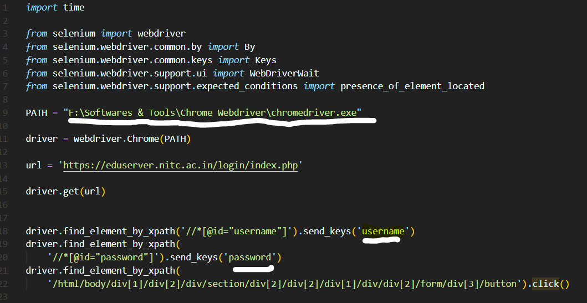

# Python-Selenium---Eduserver-Attendance-keeper

Hi guys,  
This is Fahadh,  
Yeah I know now a days its becaming hard to mark attendance in eduserver, due to our neglegence or some other work at home, it misses sometimes in just seconds.  
To solve this issuse, this repo contains small code written in python using it's Selenium package.

### After downloading this repo all have to do some steps in order to run it properly

- Install selenium package in our pc
  - using command in cdm terminal or in GIT Bash  
    <code><b>pip install selenium</b></code>
- Then you have to download web driver for chrome.  
  Follow this link to [download it.](https://sites.google.com/a/chromium.org/chromedriver/)  
  `NOTE: Download Chrome webdriver which supports your PC's Chrome brower(by check your browser current version).`
- After this unzip downloaded folder, copy chromewebdriver.exe, paste some where in PC except in C drive and copy it's path(address).
- Now open our repo in code editor to make some changes in code
  
  - Change path to path where you pasted web driver and add "\chromedriver.exe" at the end if required.
  - Fill your username in place of username as shown in photo below.
  - Do it same for your password too.

### Now your code is ready to run, add action of running it in windows task scheduler [Kepper.py](Keeper.py) file.

To know how to add task to task scheduler in windows follows this [link.](https://youtu.be/n2Cr_YRQk7o)

This helps you atleast relax in between classes without hurriedly marking attendance😎😎😎

### How it works?

- It opens up chrome browser and get you to eduserver login page.
- Then fill the form and login to it.
- Now it check for first attendance link and opens it.
- If we have Submit attendance option then opens it and mark attendance and closes itself, else it refreshes page for every 5 seconds and check for the Submit attendance option.
